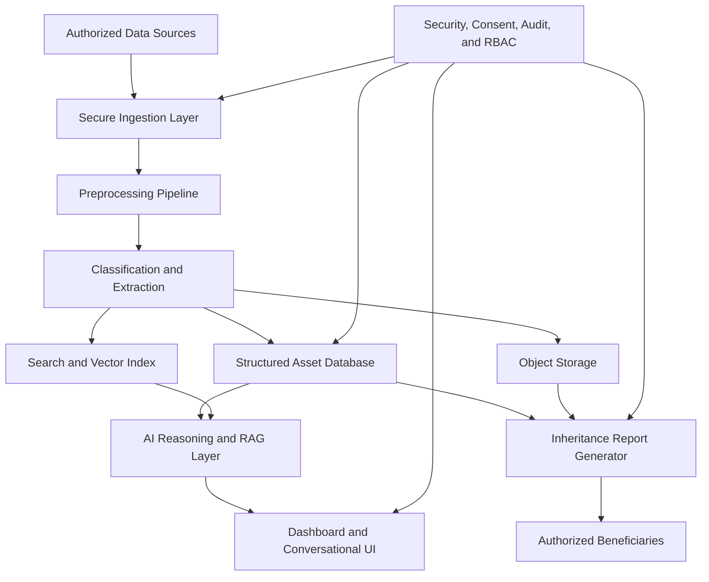

# System Architecture

## Architecture Overview

The AI-Powered Digital Legacy Manager can be designed as a modular platform with separate ingestion, intelligence, storage, retrieval, security, and reporting layers.

## Layers

### 1. Data Source Layer

Supported data sources may include:

- Gmail and Outlook
- Google Drive, Dropbox, and OneDrive
- Local folders and external drives
- Social media exports
- Bank statement uploads
- Insurance and investment document uploads
- Scanned documents and image archives

### 2. Ingestion Layer

The ingestion layer handles authorization, connector scheduling, file syncing, deduplication, file hashing, metadata extraction, and secure storage. Every ingested item should receive a stable asset ID.

### 3. Preprocessing Layer

Preprocessing prepares raw files for AI analysis:

- PDF parsing
- Image enhancement
- OCR extraction
- Language detection
- Metadata normalization
- Date extraction
- Duplicate detection
- File type identification

### 4. Intelligence Layer

The intelligence layer transforms raw assets into structured records:

- Document classification
- Entity extraction
- Financial record detection
- Insurance policy detection
- Subscription detection
- Legal document detection
- Face clustering
- Event timeline extraction
- Summarization

### 5. Storage Layer

Recommended storage components:

- Object storage for original files and generated artifacts
- PostgreSQL for structured metadata and access control
- Vector database for semantic retrieval
- Search index for keyword search and filtering
- Audit log store for access events and security review

### 6. Retrieval and RAG Layer

The RAG layer supports natural language questions by:

- Searching relevant assets.
- Retrieving source text and metadata.
- Ranking results.
- Asking an LLM to produce grounded answers.
- Returning links to original files and extracted evidence.

### 7. Application Layer

Primary user interfaces:

- Owner dashboard
- Beneficiary dashboard
- Asset inventory view
- Memory timeline view
- Document summary view
- Financial and subscription overview
- Conversational search
- Inheritance report export

### 8. Security Layer

Security must be treated as a foundational layer:

- End-to-end encryption for sensitive assets
- Encryption at rest and in transit
- Role-based access control
- Multi-factor authentication
- Consent and authorization management
- Beneficiary verification
- Audit logs
- Emergency access workflow
- Data retention and deletion controls

## Suggested Data Model

### Asset

- `id`
- `owner_id`
- `source`
- `source_asset_id`
- `file_name`
- `file_type`
- `hash`
- `created_at`
- `modified_at`
- `asset_category`
- `sensitivity_level`
- `storage_uri`
- `processing_status`

### ExtractedDocument

- `asset_id`
- `ocr_text`
- `summary`
- `document_type`
- `entities`
- `dates`
- `amounts`
- `confidence_score`

### FinancialRecord

- `asset_id`
- `institution`
- `account_type`
- `account_reference`
- `detected_balance`
- `recurring_payment`
- `premium_or_installment`
- `maturity_date`
- `liability_flag`

### MemoryEvent

- `id`
- `owner_id`
- `title`
- `event_date`
- `location`
- `people`
- `related_assets`
- `confidence_score`
- `generated_description`

### BeneficiaryAccess

- `id`
- `owner_id`
- `beneficiary_id`
- `role`
- `access_scope`
- `activation_condition`
- `status`
- `created_at`
- `activated_at`

## Key Workflows

### Asset Ingestion

1. User authorizes a data source.
2. Connector fetches metadata and files.
3. System stores files securely.
4. Pipeline extracts text, metadata, and embeddings.
5. Classifier assigns categories and sensitivity levels.
6. Structured records are stored for search and reporting.

### Document Summarization

1. User uploads or syncs a document.
2. OCR extracts text if required.
3. Classifier identifies document type.
4. Entity extractor finds names, dates, amounts, accounts, and obligations.
5. LLM generates a human-readable summary.
6. Summary is linked to source evidence.

### Inheritance Report Generation

1. Authorized workflow is triggered.
2. System validates beneficiary access rights.
3. Relevant assets are selected by role and scope.
4. Sensitive sections are encrypted or redacted as needed.
5. Report is generated with summaries and source links.
6. Access event is recorded in audit logs.

## Security Considerations

- Never expose full credentials in inheritance reports.
- Prefer delegated access tokens and revocable connector permissions.
- Encrypt highly sensitive document fields separately.
- Keep generated summaries access-controlled like source documents.
- Record every beneficiary access event.
- Use human review for high-risk legal or financial conclusions.
- Provide confidence scores for AI-generated classifications.

## Development Notes

For an MVP, prioritize upload-based ingestion before complex live integrations. This reduces security and connector complexity while still demonstrating OCR, classification, summarization, search, timeline creation, and report generation.
